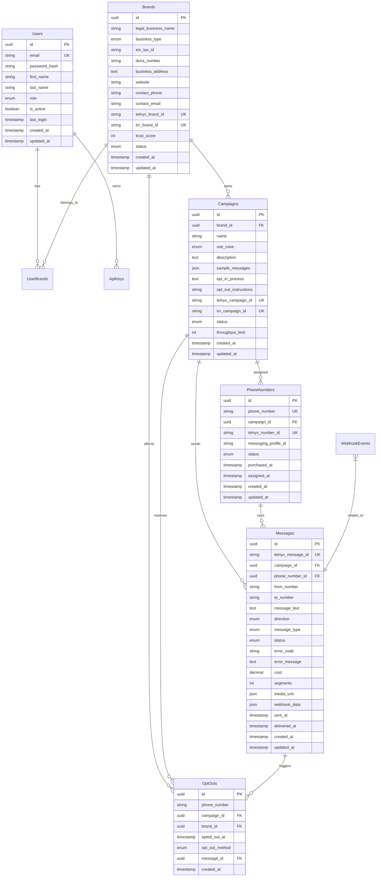

# Database Design Document - 10DLC SMS System

## Table of Contents
1. [Overview](#overview)
2. [Database Architecture](#database-architecture)
3. [Entity Relationship Diagram](#entity-relationship-diagram)
4. [Table Specifications](#table-specifications)
5. [Indexing Strategy](#indexing-strategy)
6. [Data Migration Strategy](#data-migration-strategy)
7. [Performance Optimization](#performance-optimization)
8. [Backup and Recovery](#backup-and-recovery)
9. [Future Scope](#future-scope)
10. [Schema Evolution](#schema-evolution)

## Overview

This document outlines the comprehensive database design for the 10DLC SMS messaging system using MySQL 8.0+. The design supports high-volume SMS operations, compliance requirements, and scalability for future growth.

### Design Principles
- **ACID Compliance**: Ensure data integrity for financial and compliance operations
- **Scalability**: Design for horizontal and vertical scaling
- **Performance**: Optimize for high-throughput message processing
- **Compliance**: Support 10DLC regulatory requirements
- **Auditability**: Maintain comprehensive audit trails
- **Flexibility**: Allow for future feature additions

### Technology Stack
- **Database**: MySQL 8.0+
- **ORM**: TypeORM with decorators
- **Connection Pooling**: MySQL2 with connection pooling
- **Migrations**: TypeORM migrations
- **Backup**: MySQL Enterprise Backup / Percona XtraBackup

## Database Architecture

### Logical Architecture
```
┌─────────────────┐    ┌─────────────────┐    ┌─────────────────┐
│   User Layer    │    │  Brand Layer    │    │ Campaign Layer  │
│                 │    │                 │    │                 │
│ • Users         │    │ • Brands        │    │ • Campaigns     │
│ • User Brands   │    │ • Brand Status  │    │ • Use Cases     │
│ • API Keys      │    │                 │    │                 │
└─────────────────┘    └─────────────────┘    └─────────────────┘
         │                       │                       │
         └───────────────────────┼───────────────────────┘
                                 │
         ┌─────────────────────────────────────────────┐
         │              Messaging Layer                │
         │                                             │
         │ • Phone Numbers    • Messages               │
         │ • Opt-outs         • Delivery Reports       │
         │ • Webhooks         • Analytics              │
         └─────────────────────────────────────────────┘
```

### Physical Architecture
```
┌─────────────────────────────────────────────────────────────┐
│                     Primary Database                        │
│  ┌─────────────────┐  ┌─────────────────┐  ┌─────────────┐ │
│  │   Core Tables   │  │ Message Tables  │  │ Audit Tables│ │
│  │                 │  │                 │  │             │ │
│  │ • users         │  │ • messages      │  │ • audit_log │ │
│  │ • brands        │  │ • opt_outs      │  │ • events    │ │
│  │ • campaigns     │  │ • webhooks      │  │             │ │
│  └─────────────────┘  └─────────────────┘  └─────────────┘ │
└─────────────────────────────────────────────────────────────┘
                                │
                                ▼
┌─────────────────────────────────────────────────────────────┐
│                   Read Replicas (Future)                    │
│  ┌─────────────────┐  ┌─────────────────┐  ┌─────────────┐ │
│  │   Replica 1     │  │   Replica 2     │  │ Analytics   │ │
│  │   (Reports)     │  │   (Backups)     │  │ Warehouse   │ │
│  └─────────────────┘  └─────────────────┘  └─────────────┘ │
└─────────────────────────────────────────────────────────────┘
```

## Entity Relationship Diagram



## Table Specifications

### Core User Management Tables

#### users
```sql
CREATE TABLE users (
    id VARCHAR(36) PRIMARY KEY,
    email VARCHAR(255) NOT NULL UNIQUE,
    password_hash VARCHAR(255) NOT NULL,
    first_name VARCHAR(100) NOT NULL,
    last_name VARCHAR(100) NOT NULL,
    role ENUM('admin', 'manager', 'user') DEFAULT 'user',
    is_active BOOLEAN DEFAULT TRUE,
    email_verified BOOLEAN DEFAULT FALSE,
    email_verification_token VARCHAR(255),
    password_reset_token VARCHAR(255),
    password_reset_expires TIMESTAMP NULL,
    last_login TIMESTAMP NULL,
    login_attempts INT DEFAULT 0,
    locked_until TIMESTAMP NULL,
    created_at TIMESTAMP DEFAULT CURRENT_TIMESTAMP,
    updated_at TIMESTAMP DEFAULT CURRENT_TIMESTAMP ON UPDATE CURRENT_TIMESTAMP,
    
    INDEX idx_email (email),
    INDEX idx_role (role),
    INDEX idx_is_active (is_active),
    INDEX idx_email_verified (email_verified),
    INDEX idx_created_at (created_at)
) ENGINE=InnoDB DEFAULT CHARSET=utf8mb4 COLLATE=utf8mb4_unicode_ci;
```

#### user_brands
```sql
CREATE TABLE user_brands (
    id VARCHAR(36) PRIMARY KEY,
    user_id VARCHAR(36) NOT NULL,
    brand_id VARCHAR(36) NOT NULL,
    role ENUM('owner', 'admin', 'member') DEFAULT 'member',
    permissions JSON,
    created_at TIMESTAMP DEFAULT CURRENT_TIMESTAMP,
    
    FOREIGN KEY (user_id) REFERENCES users(id) ON DELETE CASCADE,
    FOREIGN KEY (brand_id) REFERENCES brands(id) ON DELETE CASCADE,
    UNIQUE KEY unique_user_brand (user_id, brand_id),
    INDEX idx_user_id (user_id),
    INDEX idx_brand_id (brand_id),
    INDEX idx_role (role)
) ENGINE=InnoDB DEFAULT CHARSET=utf8mb4 COLLATE=utf8mb4_unicode_ci;
```

#### api_keys
```sql
CREATE TABLE api_keys (
    id VARCHAR(36) PRIMARY KEY,
    user_id VARCHAR(36) NOT NULL,
    key_name VARCHAR(100) NOT NULL,
    api_key VARCHAR(255) NOT NULL UNIQUE,
    api_key_hash VARCHAR(255) NOT NULL,
    permissions JSON,
    rate_limit_per_minute INT DEFAULT 60,
    rate_limit_per_hour INT DEFAULT 1000,
    is_active BOOLEAN DEFAULT TRUE,
    last_used TIMESTAMP NULL,
    last_used_ip VARCHAR(45),
    usage_count BIGINT DEFAULT 0,
    expires_at TIMESTAMP NULL,
    created_at TIMESTAMP DEFAULT CURRENT_TIMESTAMP,
    updated_at TIMESTAMP DEFAULT CURRENT_TIMESTAMP ON UPDATE CURRENT_TIMESTAMP,
    
    FOREIGN KEY (user_id) REFERENCES users(id) ON DELETE CASCADE,
    INDEX idx_api_key (api_key),
    INDEX idx_user_id (user_id),
    INDEX idx_is_active (is_active),
    INDEX idx_expires_at (expires_at)
) ENGINE=InnoDB DEFAULT CHARSET=utf8mb4 COLLATE=utf8mb4_unicode_ci;
```

### Brand and Campaign Management Tables

#### brands
```sql
CREATE TABLE brands (
    id VARCHAR(36) PRIMARY KEY,
    legal_business_name VARCHAR(255) NOT NULL,
    business_type ENUM('LLC', 'Corporation', 'Sole_Proprietor', 'Partnership', 'Other') NOT NULL,
    ein_tax_id VARCHAR(50),
    duns_number VARCHAR(20),
    business_address TEXT NOT NULL,
    website VARCHAR(255),
    contact_phone VARCHAR(20) NOT NULL,
    contact_email VARCHAR(255) NOT NULL,
    telnyx_brand_id VARCHAR(100) UNIQUE,
    tcr_brand_id VARCHAR(100) UNIQUE,
    trust_score INT DEFAULT 0,
    status ENUM('pending', 'approved', 'rejected', 'suspended') DEFAULT 'pending',
    status_reason TEXT,
    registration_date TIMESTAMP NULL,
    approval_date TIMESTAMP NULL,
    created_at TIMESTAMP DEFAULT CURRENT_TIMESTAMP,
    updated_at TIMESTAMP DEFAULT CURRENT_TIMESTAMP ON UPDATE CURRENT_TIMESTAMP,
    
    INDEX idx_status (status),
    INDEX idx_telnyx_brand_id (telnyx_brand_id),
    INDEX idx_tcr_brand_id (tcr_brand_id),
    INDEX idx_business_type (business_type),
    INDEX idx_trust_score (trust_score),
    INDEX idx_created_at (created_at),
    FULLTEXT idx_business_name (legal_business_name)
) ENGINE=InnoDB DEFAULT CHARSET=utf8mb4 COLLATE=utf8mb4_unicode_ci;
```

#### campaigns
```sql
CREATE TABLE campaigns (
    id VARCHAR(36) PRIMARY KEY,
    brand_id VARCHAR(36) NOT NULL,
    name VARCHAR(255) NOT NULL,
    use_case ENUM('customer_care', 'marketing', '2fa', 'account_notifications', 'public_service') NOT NULL,
    description TEXT,
    sample_messages JSON,
    opt_in_process TEXT NOT NULL,
    opt_out_instructions VARCHAR(500) DEFAULT 'Reply STOP to unsubscribe',
    telnyx_campaign_id VARCHAR(100) UNIQUE,
    tcr_campaign_id VARCHAR(100) UNIQUE,
    status ENUM('pending', 'approved', 'rejected', 'suspended') DEFAULT 'pending',
    status_reason TEXT,
    throughput_limit INT DEFAULT 1,
    daily_limit INT DEFAULT 1000,
    monthly_limit INT DEFAULT 30000,
    auto_renewal BOOLEAN DEFAULT TRUE,
    expires_at TIMESTAMP NULL,
    created_at TIMESTAMP DEFAULT CURRENT_TIMESTAMP,
    updated_at TIMESTAMP DEFAULT CURRENT_TIMESTAMP ON UPDATE CURRENT_TIMESTAMP,
    
    FOREIGN KEY (brand_id) REFERENCES brands(id) ON DELETE CASCADE,
    INDEX idx_brand_id (brand_id),
    INDEX idx_status (status),
    INDEX idx_use_case (use_case),
    INDEX idx_telnyx_campaign_id (telnyx_campaign_id),
    INDEX idx_expires_at (expires_at),
    FULLTEXT idx_name_description (name, description)
) ENGINE=InnoDB DEFAULT CHARSET=utf8mb4 COLLATE=utf8mb4_unicode_ci;
```

### Messaging Tables

#### phone_numbers
```sql
CREATE TABLE phone_numbers (
    id VARCHAR(36) PRIMARY KEY,
    phone_number VARCHAR(20) NOT NULL UNIQUE,
    campaign_id VARCHAR(36),
    telnyx_number_id VARCHAR(100) UNIQUE,
    messaging_profile_id VARCHAR(100),
    status ENUM('available', 'assigned', 'suspended', 'porting') DEFAULT 'available',
    country_code VARCHAR(3) DEFAULT 'US',
    area_code VARCHAR(5),
    number_type ENUM('local', 'toll_free', 'mobile') DEFAULT 'local',
    monthly_cost DECIMAL(10, 4),
    purchased_at TIMESTAMP DEFAULT CURRENT_TIMESTAMP,
    assigned_at TIMESTAMP NULL,
    last_used TIMESTAMP NULL,
    created_at TIMESTAMP DEFAULT CURRENT_TIMESTAMP,
    updated_at TIMESTAMP DEFAULT CURRENT_TIMESTAMP ON UPDATE CURRENT_TIMESTAMP,
    
    FOREIGN KEY (campaign_id) REFERENCES campaigns(id) ON DELETE SET NULL,
    INDEX idx_phone_number (phone_number),
    INDEX idx_campaign_id (campaign_id),
    INDEX idx_status (status),
    INDEX idx_telnyx_number_id (telnyx_number_id),
    INDEX idx_area_code (area_code),
    INDEX idx_number_type (number_type)
) ENGINE=InnoDB DEFAULT CHARSET=utf8mb4 COLLATE=utf8mb4_unicode_ci;
```

#### messages
```sql
CREATE TABLE messages (
    id VARCHAR(36) PRIMARY KEY,
    telnyx_message_id VARCHAR(100) UNIQUE,
    campaign_id VARCHAR(36),
    phone_number_id VARCHAR(36) NOT NULL,
    from_number VARCHAR(20) NOT NULL,
    to_number VARCHAR(20) NOT NULL,
    message_text TEXT NOT NULL,
    direction ENUM('inbound', 'outbound') NOT NULL,
    message_type ENUM('SMS', 'MMS') DEFAULT 'SMS',
    status ENUM('queued', 'sent', 'delivered', 'failed', 'received') NOT NULL,
    error_code VARCHAR(50),
    error_message TEXT,
    cost DECIMAL(10, 6),
    segments INT DEFAULT 1,
    encoding ENUM('GSM-7', 'UCS-2') DEFAULT 'GSM-7',
    media_urls JSON,
    webhook_data JSON,
    sent_at TIMESTAMP NULL,
    delivered_at TIMESTAMP NULL,
    retry_count INT DEFAULT 0,
    priority ENUM('low', 'normal', 'high') DEFAULT 'normal',
    scheduled_at TIMESTAMP NULL,
    expires_at TIMESTAMP NULL,
    created_at TIMESTAMP DEFAULT CURRENT_TIMESTAMP,
    updated_at TIMESTAMP DEFAULT CURRENT_TIMESTAMP ON UPDATE CURRENT_TIMESTAMP,
    
    FOREIGN KEY (campaign_id) REFERENCES campaigns(id) ON DELETE SET NULL,
    FOREIGN KEY (phone_number_id) REFERENCES phone_numbers(id) ON DELETE CASCADE,
    INDEX idx_telnyx_message_id (telnyx_message_id),
    INDEX idx_campaign_id (campaign_id),
    INDEX idx_phone_numbers (from_number, to_number),
    INDEX idx_direction (direction),
    INDEX idx_status (status),
    INDEX idx_created_at (created_at),
    INDEX idx_sent_at (sent_at),
    INDEX idx_scheduled_at (scheduled_at),
    INDEX idx_composite_search (campaign_id, status, created_at)
) ENGINE=InnoDB DEFAULT CHARSET=utf8mb4 COLLATE=utf8mb4_unicode_ci;
```

### Compliance Tables

#### opt_outs
```sql
CREATE TABLE opt_outs (
    id VARCHAR(36) PRIMARY KEY,
    phone_number VARCHAR(20) NOT NULL,
    campaign_id VARCHAR(36),
    brand_id VARCHAR(36),
    opted_out_at TIMESTAMP DEFAULT CURRENT_TIMESTAMP,
    opt_out_method ENUM('sms_reply', 'manual', 'api', 'web_form') DEFAULT 'sms_reply',
    message_id VARCHAR(36),
    reason TEXT,
    is_global BOOLEAN DEFAULT FALSE,
    expires_at TIMESTAMP NULL,
    created_at TIMESTAMP DEFAULT CURRENT_TIMESTAMP,
    
    FOREIGN KEY (campaign_id) REFERENCES campaigns(id) ON DELETE SET NULL,
    FOREIGN KEY (brand_id) REFERENCES brands(id) ON DELETE SET NULL,
    FOREIGN KEY (message_id) REFERENCES messages(id) ON DELETE SET NULL,
    UNIQUE KEY unique_phone_campaign (phone_number, campaign_id),
    INDEX idx_phone_number (phone_number),
    INDEX idx_campaign_id (campaign_id),
    INDEX idx_brand_id (brand_id),
    INDEX idx_opted_out_at (opted_out_at),
    INDEX idx_is_global (is_global),
    INDEX idx_expires_at (expires_at)
) ENGINE=InnoDB DEFAULT CHARSET=utf8mb4 COLLATE=utf8mb4_unicode_ci;
```

### Webhook and Event Tables

#### webhook_events
```sql
CREATE TABLE webhook_events (
    id VARCHAR(36) PRIMARY KEY,
    event_type VARCHAR(100) NOT NULL,
    resource_id VARCHAR(100),
    resource_type ENUM('message', 'number', 'campaign', 'brand'),
    payload JSON NOT NULL,
    signature VARCHAR(255),
    processed BOOLEAN DEFAULT FALSE,
    processing_error TEXT,
    retry_count INT DEFAULT 0,
    priority ENUM('low', 'normal', 'high') DEFAULT 'normal',
    scheduled_for TIMESTAMP NULL,
    created_at TIMESTAMP DEFAULT CURRENT_TIMESTAMP,
    processed_at TIMESTAMP NULL,
    
    INDEX idx_event_type (event_type),
    INDEX idx_resource_type (resource_type),
    INDEX idx_processed (processed),
    INDEX idx_created_at (created_at),
    INDEX idx_retry_count (retry_count),
    INDEX idx_scheduled_for (scheduled_for)
) ENGINE=InnoDB DEFAULT CHARSET=utf8mb4 COLLATE=utf8mb4_unicode_ci;
```

## Indexing Strategy

### Primary Indexes
- **Primary Keys**: All tables use UUID primary keys for global uniqueness
- **Foreign Keys**: All foreign key relationships have corresponding indexes
- **Unique Constraints**: Enforced at database level for data integrity

### Secondary Indexes
- **Composite Indexes**: Optimized for common query patterns
- **Partial Indexes**: For filtered queries on status fields
- **Fulltext Indexes**: For search functionality on text fields

### Query-Specific Indexes
```sql
-- Message performance indexes
CREATE INDEX idx_messages_campaign_status_date 
ON messages(campaign_id, status, created_at);

CREATE INDEX idx_messages_phone_direction_date 
ON messages(from_number, direction, created_at);

-- Analytics indexes
CREATE INDEX idx_messages_daily_stats 
ON messages(campaign_id, status, DATE(created_at));

-- Opt-out lookup optimization
CREATE INDEX idx_optouts_phone_active 
ON opt_outs(phone_number, campaign_id) 
WHERE expires_at IS NULL OR expires_at > NOW();
```

## Data Migration Strategy

### Migration Framework
```typescript
// src/migrations/001_initial_schema.ts
import { MigrationInterface, QueryRunner } from 'typeorm';

export class InitialSchema1234567890 implements MigrationInterface {
    name = 'InitialSchema1234567890';

    public async up(queryRunner: QueryRunner): Promise<void> {
        // Create users table
        await queryRunner.query(`
            CREATE TABLE users (
                id VARCHAR(36) PRIMARY KEY,
                -- ... table definition
            )
        `);
        
        // Add indexes
        await queryRunner.query(`
            CREATE INDEX idx_users_email ON users(email)
        `);
    }

    public async down(queryRunner: QueryRunner): Promise<void> {
        await queryRunner.query(`DROP TABLE users`);
    }
}
```

### Version Control
- **Sequential Numbering**: Timestamp-based migration names
- **Rollback Support**: Every migration includes down() method
- **Data Preservation**: Migrations preserve existing data
- **Testing**: All migrations tested in staging environment

### Migration Best Practices
1. **Backwards Compatibility**: New columns are nullable or have defaults
2. **Index Creation**: Online DDL for minimal downtime
3. **Data Migration**: Separate data migration scripts for large changes
4. **Validation**: Post-migration data integrity checks

## Performance Optimization

### Query Optimization
```sql
-- Optimized message retrieval
SELECT m.*, pn.phone_number, c.name as campaign_name
FROM messages m
JOIN phone_numbers pn ON m.phone_number_id = pn.id
JOIN campaigns c ON m.campaign_id = c.id
WHERE m.campaign_id = ? 
  AND m.created_at >= DATE_SUB(NOW(), INTERVAL 30 DAY)
ORDER BY m.created_at DESC
LIMIT 50;

-- Optimized opt-out check
SELECT 1 FROM opt_outs 
WHERE phone_number = ? 
  AND (campaign_id = ? OR is_global = TRUE)
  AND (expires_at IS NULL OR expires_at > NOW())
LIMIT 1;
```

### Connection Pooling
```typescript
// Database configuration
export const dataSourceOptions = {
    type: 'mysql',
    host: process.env.DB_HOST,
    port: parseInt(process.env.DB_PORT || '3306'),
    username: process.env.DB_USERNAME,
    password: process.env.DB_PASSWORD,
    database: process.env.DB_DATABASE,
    
    // Connection pooling
    extra: {
        connectionLimit: 20,
        acquireTimeout: 60000,
        timeout: 60000,
        reconnect: true,
    },
    
    // Query optimization
    cache: {
        duration: 30000, // 30 seconds
    },
    
    logging: process.env.NODE_ENV === 'development' ? 'all' : ['error'],
};
```

### Partitioning Strategy (Future)
```sql
-- Partition messages table by date
ALTER TABLE messages 
PARTITION BY RANGE (YEAR(created_at)) (
    PARTITION p2024 VALUES LESS THAN (2025),
    PARTITION p2025 VALUES LESS THAN (2026),
    PARTITION p2026 VALUES LESS THAN (2027),
    PARTITION pmax VALUES LESS THAN MAXVALUE
);
```

## Backup and Recovery

### Backup Strategy
```bash
#!/bin/bash
# Daily backup script

# Full backup
mysqldump --single-transaction --routines --triggers \
  --all-databases > backup_$(date +%Y%m%d).sql

# Incremental backup using binlog
mysqlbinlog --start-datetime="$(date -d '1 day ago' '+%Y-%m-%d %H:%M:%S')" \
  /var/lib/mysql/mysql-bin.* > incremental_$(date +%Y%m%d).sql

# Upload to S3
aws s3 cp backup_$(date +%Y%m%d).sql s3://our-backups/mysql/
```

### Point-in-Time Recovery
```bash
# Restore to specific point in time
mysql < backup_20241201.sql
mysqlbinlog --stop-datetime="2024-12-01 14:30:00" \
  incremental_20241201.sql | mysql
```

### Monitoring
```sql
-- Database health checks
SELECT 
    TABLE_NAME,
    TABLE_ROWS,
    DATA_LENGTH,
    INDEX_LENGTH,
    DATA_FREE
FROM information_schema.TABLES 
WHERE TABLE_SCHEMA = 'telnyx_10dlc';

-- Performance metrics
SHOW GLOBAL STATUS LIKE 'Threads_%';
SHOW GLOBAL STATUS LIKE 'Innodb_%';
```

## Future Scope

### Phase 1: Enhanced Analytics (Q1 2024)
```sql
-- Message analytics table
CREATE TABLE message_analytics (
    id VARCHAR(36) PRIMARY KEY,
    campaign_id VARCHAR(36) NOT NULL,
    date DATE NOT NULL,
    messages_sent INT DEFAULT 0,
    messages_delivered INT DEFAULT 0,
    messages_failed INT DEFAULT 0,
    opt_outs INT DEFAULT 0,
    total_cost DECIMAL(12, 6) DEFAULT 0,
    created_at TIMESTAMP DEFAULT CURRENT_TIMESTAMP,
    
    FOREIGN KEY (campaign_id) REFERENCES campaigns(id),
    UNIQUE KEY unique_campaign_date (campaign_id, date),
    INDEX idx_date (date)
);

-- Campaign performance metrics
CREATE TABLE campaign_metrics (
    id VARCHAR(36) PRIMARY KEY,
    campaign_id VARCHAR(36) NOT NULL,
    metric_type ENUM('delivery_rate', 'opt_out_rate', 'cost_per_message', 'response_rate'),
    metric_value DECIMAL(10, 6),
    period_start DATE,
    period_end DATE,
    created_at TIMESTAMP DEFAULT CURRENT_TIMESTAMP,
    
    FOREIGN KEY (campaign_id) REFERENCES campaigns(id),
    INDEX idx_campaign_metric (campaign_id, metric_type),
    INDEX idx_period (period_start, period_end)
);
```

### Phase 2: Multi-Provider Support (Q2 2024)
```sql
-- SMS providers table
CREATE TABLE sms_providers (
    id VARCHAR(36) PRIMARY KEY,
    name VARCHAR(100) NOT NULL,
    provider_type ENUM('telnyx', 'twilio', 'bandwidth', 'messagebird'),
    api_endpoint VARCHAR(255),
    configuration JSON,
    is_active BOOLEAN DEFAULT TRUE,
    priority INT DEFAULT 1,
    created_at TIMESTAMP DEFAULT CURRENT_TIMESTAMP
);

-- Provider routing rules
CREATE TABLE routing_rules (
    id VARCHAR(36) PRIMARY KEY,
    campaign_id VARCHAR(36),
    provider_id VARCHAR(36) NOT NULL,
    conditions JSON,
    priority INT DEFAULT 1,
    is_active BOOLEAN DEFAULT TRUE,
    
    FOREIGN KEY (campaign_id) REFERENCES campaigns(id),
    FOREIGN KEY (provider_id) REFERENCES sms_providers(id)
);
```

### Phase 3: Advanced Features (Q3 2024)
```sql
-- Message templates
CREATE TABLE message_templates (
    id VARCHAR(36) PRIMARY KEY,
    campaign_id VARCHAR(36) NOT NULL,
    name VARCHAR(255) NOT NULL,
    template_content TEXT NOT NULL,
    variables JSON,
    is_active BOOLEAN DEFAULT TRUE,
    usage_count INT DEFAULT 0,
    created_at TIMESTAMP DEFAULT CURRENT_TIMESTAMP,
    
    FOREIGN KEY (campaign_id) REFERENCES campaigns(id),
    INDEX idx_campaign_active (campaign_id, is_active)
);

-- Scheduled messages
CREATE TABLE scheduled_messages (
    id VARCHAR(36) PRIMARY KEY,
    template_id VARCHAR(36) NOT NULL,
    recipient_list JSON NOT NULL,
    scheduled_at TIMESTAMP NOT NULL,
    status ENUM('pending', 'processing', 'completed', 'failed') DEFAULT 'pending',
    created_by VARCHAR(36) NOT NULL,
    created_at TIMESTAMP DEFAULT CURRENT_TIMESTAMP,
    
    FOREIGN KEY (template_id) REFERENCES message_templates(id),
    FOREIGN KEY (created_by) REFERENCES users(id),
    INDEX idx_scheduled_at (scheduled_at),
    INDEX idx_status (status)
);

-- Contact management
CREATE TABLE contacts (
    id VARCHAR(36) PRIMARY KEY,
    phone_number VARCHAR(20) NOT NULL,
    first_name VARCHAR(100),
    last_name VARCHAR(100),
    email VARCHAR(255),
    properties JSON,
    created_by VARCHAR(36) NOT NULL,
    created_at TIMESTAMP DEFAULT CURRENT_TIMESTAMP,
    updated_at TIMESTAMP DEFAULT CURRENT_TIMESTAMP ON UPDATE CURRENT_TIMESTAMP,
    
    FOREIGN KEY (created_by) REFERENCES users(id),
    UNIQUE KEY unique_phone_creator (phone_number, created_by),
    INDEX idx_phone_number (phone_number),
    INDEX idx_email (email)
);
```

### Phase 4: AI/ML Integration (Q4 2024)
```sql
-- Message sentiment analysis
CREATE TABLE message_sentiment (
    id VARCHAR(36) PRIMARY KEY,
    message_id VARCHAR(36) NOT NULL,
    sentiment_score DECIMAL(5, 4),
    sentiment_label ENUM('positive', 'negative', 'neutral'),
    confidence DECIMAL(5, 4),
    keywords JSON,
    analyzed_at TIMESTAMP DEFAULT CURRENT_TIMESTAMP,
    
    FOREIGN KEY (message_id) REFERENCES messages(id),
    INDEX idx_message_id (message_id),
    INDEX idx_sentiment (sentiment_label)
);

-- Predictive analytics
CREATE TABLE delivery_predictions (
    id VARCHAR(36) PRIMARY KEY,
    campaign_id VARCHAR(36) NOT NULL,
    predicted_delivery_rate DECIMAL(5, 4),
    predicted_opt_out_rate DECIMAL(5, 4),
    factors JSON,
    prediction_date DATE,
    actual_delivery_rate DECIMAL(5, 4),
    created_at TIMESTAMP DEFAULT CURRENT_TIMESTAMP,
    
    FOREIGN KEY (campaign_id) REFERENCES campaigns(id),
    INDEX idx_campaign_date (campaign_id, prediction_date)
);
```

## Schema Evolution

### Version Management
```typescript
// Schema versioning strategy
export interface SchemaVersion {
    version: string;
    description: string;
    migrations: string[];
    rollback: string[];
    dependencies: string[];
}

// Version 2.0.0 - Multi-provider support
export const SchemaV2: SchemaVersion = {
    version: '2.0.0',
    description: 'Multi-provider SMS support',
    migrations: [
        'CreateSmsProvidersTable',
        'CreateRoutingRulesTable',
        'AddProviderIdToMessages'
    ],
    rollback: [
        'RemoveProviderIdFromMessages',
        'DropRoutingRulesTable',
        'DropSmsProvidersTable'
    ],
    dependencies: ['1.0.0']
};
```

### Backwards Compatibility
- **Graceful Degradation**: New features don't break existing functionality
- **API Versioning**: Maintain multiple API versions during transitions
- **Data Migration**: Automatic data conversion during upgrades
- **Feature Flags**: Toggle new features without schema changes

### Monitoring Schema Changes
```sql
-- Schema change audit table
CREATE TABLE schema_changes (
    id VARCHAR(36) PRIMARY KEY,
    version VARCHAR(20) NOT NULL,
    change_type ENUM('table_create', 'table_alter', 'index_create', 'data_migration'),
    table_name VARCHAR(100),
    change_description TEXT,
    applied_by VARCHAR(100),
    applied_at TIMESTAMP DEFAULT CURRENT_TIMESTAMP,
    
    INDEX idx_version (version),
    INDEX idx_applied_at (applied_at)
);
```

### Database Maintenance

#### Automated Cleanup
```sql
-- Archive old webhook events (>90 days)
INSERT INTO webhook_events_archive 
SELECT * FROM webhook_events 
WHERE created_at < DATE_SUB(NOW(), INTERVAL 90 DAY);

DELETE FROM webhook_events 
WHERE created_at < DATE_SUB(NOW(), INTERVAL 90 DAY);

-- Clean up processed events
DELETE FROM webhook_events 
WHERE processed = TRUE 
  AND created_at < DATE_SUB(NOW(), INTERVAL 30 DAY);
```

#### Performance Monitoring
```sql
-- Query performance analysis
SELECT 
    DIGEST_TEXT,
    COUNT_STAR,
    AVG_TIMER_WAIT/1000000000000 as avg_exec_time_sec,
    SUM_ROWS_EXAMINED/COUNT_STAR as avg_rows_examined
FROM performance_schema.events_statements_summary_by_digest 
ORDER BY AVG_TIMER_WAIT DESC 
LIMIT 10;
```

## Conclusion

This database design provides a robust foundation for the 10DLC SMS system with:

- **Scalability**: Designed to handle millions of messages
- **Compliance**: Built-in support for 10DLC requirements
- **Performance**: Optimized indexes and query patterns
- **Flexibility**: Extensible schema for future features
- **Reliability**: Comprehensive backup and recovery strategies

The design supports current requirements while providing a clear path for future enhancements including multi-provider support, advanced analytics, and AI-powered features.
